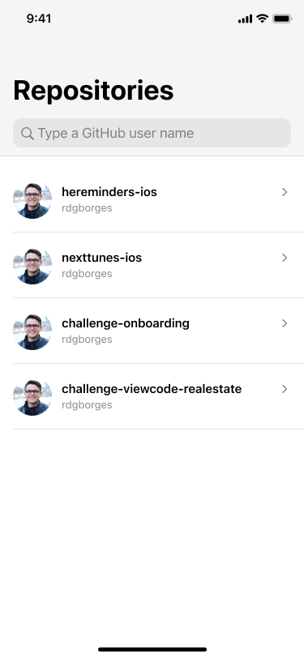
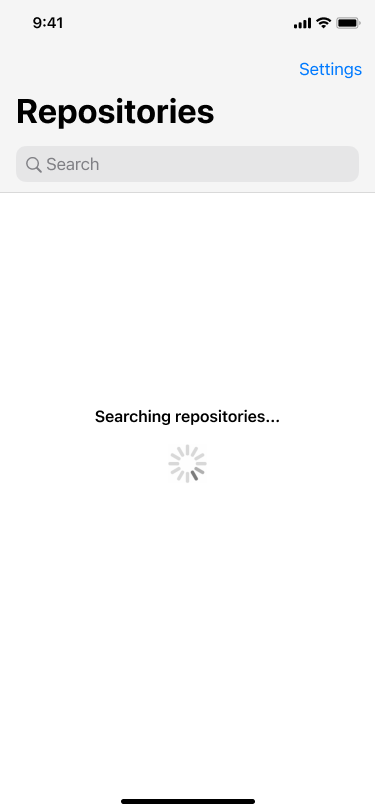
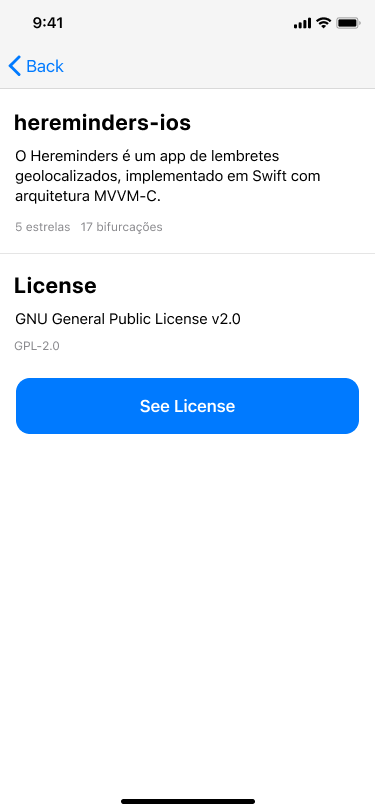

# GitHub App Challenge 🐙

In this challenge, we are going to integrate with the GitHub API to show a user's repository list, with navigation to a repository's details. During the Dev Sprint, we also follow good practices of both Git flow and Agile development.

# Contributing

1. Clone this repository.
2. Start a new feature branch.
3. Open `solutions` folder and access your Dev Sprint's project.
4. Build, run and code! 👩‍💻

# About Devpass

Devpass is a diverse community of high-potential software developers accelerating their careers through real-world product development and mentorship from tech leaders of the best tech companies.

Interested? Access www.devpass.com.br for more information!

# How to contribute

1. Fork & clone this repository
2. Create a new feature branch
3. Code! 👩‍💻
4. Open a Pull Request
